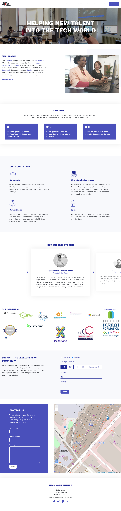

# Hackyourfuture.be Home Page

In the 2nd and 3rd week of HackYourFutureBE web development course, we are building homepage of the hackyourfuture.be website together as a group.

## Table of contents
- [Hackyourfuture.be Home Page](#hackyourfuturebe-home-page)
  - [Table of contents](#table-of-contents)
  - [General info](#general-info)
  - [Group Info](#group-info)
  - [Assigned Coach](#assigned-coach)
  - [Technologies](#technologies)
  - [Status](#status)
  - [Contributions](#contributions)
  - [Contributing](#contributing)
  - [Screenshots](#screenshots)

## General info
Making a responsive web design that simulates a platform for building applications of all types with modern architecture and scaling. We will work along with Git and GitHub. This project in intent to be complete it by the second and third week of Incremental Development in HYF Belgium program.

## Group Info
- [Zehra ](https://github.com/zehrayelkenci)
- [Furkan](https://github.com/emelysalmeron)
- [Joexy](https://github.com/Joexy1990)
- [Zara](https://github.com/zaraana)
- [Emely](https://github.com/emelysalmeron)
- [Selim ](https://github.com/selimensar)

Before we start coding, we complete the planning files together as a group. Then we try to code the website by inspecting on the live website. While pushing our Github commits, we create new branches. We have frequent meetings and help our friends who are the group who need help.
## Assigned Coach 
- [Unmesh](https://github.com/unmeshvrije)
## Technologies
Project is created with:

* HTML5
* CSS
## Status

In progress.
## Contributions

All contributions are welcome.
## Contributing
Pull requests are welcome. For major changes, please open an issue first to discuss what you would like to change.

Please make sure to update tests as appropriate.
## Screenshots
